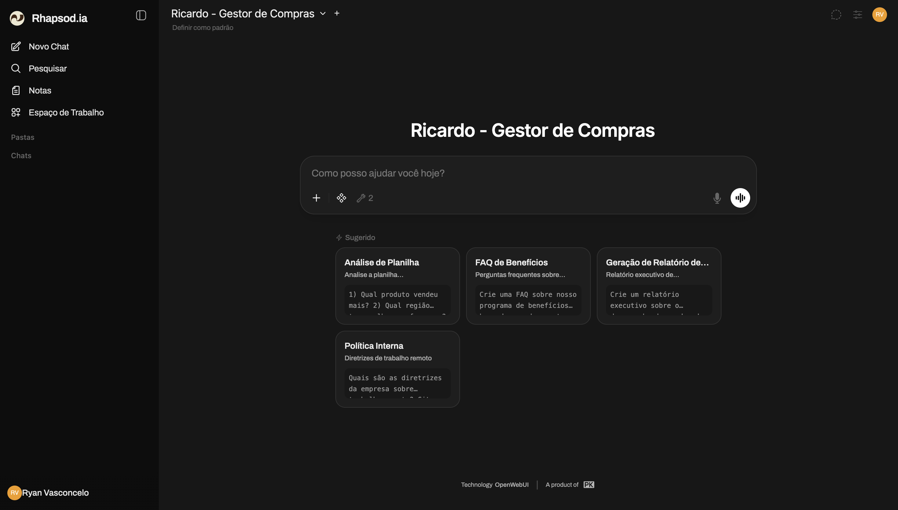

# Primeiros Passos com o Rhapsodia

Este guia vai te ajudar a dar os primeiros passos na plataforma em menos de 10 minutos.

## Passo 1: Fazendo Login

1. Acesse a URL fornecida pelo seu administrador
2. Digite seu email corporativo
3. Insira sua senha
4. Clique em "Entrar"

> **Dica**: Ative "Lembrar-me" se estiver em um computador seguro

## Passo 2: Conhecendo a Interface

### Áreas Principais

1. **Barra Lateral Esquerda**
   - Histórico de conversas
   - Workspaces
   - Documentos

2. **Área Central**
   - Chat com a IA
   - Visualização de respostas
   - Upload de arquivos

3. **Barra Superior**
   - Seleção de modelos
   - Configurações
   - Perfil

## Passo 3: Sua Primeira Conversa

### Exemplo Simples

Digite no chat: "Olá! Me ajude a entender o que posso fazer aqui"

### Exemplo com Documento

1. Clique no ícone de clip 📎
2. Selecione um documento (PDF, Excel, Word)
3. Digite: "Analise este documento e faça um resumo"

## Passo 4: Usando Templates

### Acessando a Biblioteca

1. Clique em "Prompts" na barra lateral
2. Escolha uma categoria (Financeiro, RH, Vendas)
3. Selecione um template
4. Personalize conforme necessário

### Templates Mais Usados

- 📊 Análise de Relatório Financeiro
- 📧 Gerador de Email Profissional
- 📝 Criador de Atas de Reunião
- 💼 Análise de Contrato

## Passo 5: Salvando seu Trabalho

### Exportar Conversa

1. Clique nos três pontos no canto superior
2. Selecione "Exportar"
3. Escolha o formato (PDF, TXT, JSON)

### Criar Workspace

1. Clique em "+" na seção Workspaces
2. Nomeie seu workspace
3. Adicione membros da equipe
4. Comece a colaborar

## Próximos Passos

✅ Você completou o setup inicial!

Agora você pode:
- [Explorar automações](../automacoes/biblioteca.md)
- [Configurar integrações](../integracoes/visao-geral.md)
- [Ler o manual completo](../manuais/usuario.md)

## Atalhos Úteis

| Atalho | Ação |
|--------|------|
| `Ctrl + /` | Nova conversa |
| `Ctrl + K` | Buscar conversas |
| `Ctrl + B` | Toggle barra lateral |
| `Ctrl + Enter` | Enviar mensagem |

## Precisa de Ajuda?

- 💡 **Dica**: Digite `/help` no chat para ver comandos disponíveis
- 📖 **Manual Completo**: [Manual do Usuário](../manuais/usuario.md)
- ❓ **FAQ**: [Perguntas Frequentes](../suporte/faq.md)